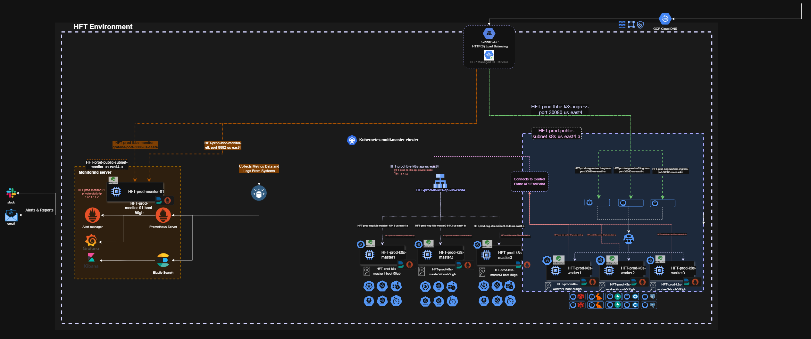

# High Frequency Trading System

## 📌 Submission Summary

### 1. **Infrastructure as Code (IaC)**
- Complete IaC implemented using Kubernetes YAML manifests.
- Includes deployments, services, HPA, affinity rules, and monitoring stack configuration (Prometheus, Grafana, ELK, OTEL Collector).
- Cluster deployed on 7 GCP VMs:  
  - **3 master nodes**  
  - **3 worker nodes**  
  - **1 monitoring/logging node** (Prometheus, Grafana, ELK stack)

### 2. **Architecture and Design Decisions**
- **Custom Kubernetes cluster** on GCP VMs (not GKE) for finer control over nodes, storage, and networking.
- **Service Mesh-less architecture** to minimize complexity.
- **Canary deployment model** with staged rollout and rollback support, ArgoCD for future.
- Observability designed with:
  - Metrics (Prometheus)
  - Logs (ELK Stack)
  - Traces (OpenTelemetry + OTLP)
Future: for better load handling and HA use GKE.
>   
> *Architecture overview of the HFT environment deployed across custom GCP VMs*

### 3. **Monitoring Dashboard**
> Due to time constraints, full dashboards and alerting integration are partially implemented. Prometheus endpoints are integrated with the app, and data is being collected.

- Dashboards are preconfigured but require final Grafana integration.

### 4. **Security Assessment Report**
- Two GitHub Actions pipelines created:
  - **SAST + SBOM generation** using Trivy and Grype.
  - **Dependency and Dockerfile scans**.
- Reports are stored as GitHub Actions artifacts.